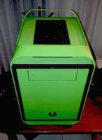

Desktop
=======

##### Spec

* CPU: Intel Core i7 4790 3.6GHz (Turbo Boost 4.00GHz)
* RAM: Crucial Ballistix Sport 12GB 1600MHz
* Motherboard: Gigabyte Z87M-D3H
* Hard Drives:
	* Samsung 850 Pro 250GB
	* Hitachi 500GB 5400rpm (from Macbook Pro)
* Screens
	* LG Flatron E2240
	* LG Flatron L226W
* GPU: Nvidia GTX 970 Strix (ASUS) 4GB
* PSU: Corsair CX600
* Case: BitFenix Prodigy M Green

##### OS Setup

* Windows 8.1 Pro
* Vmware running:
	* Ubuntu 14.04 (same as with Macbook's)
	* OS X 10.10 (Yosemite)

##### Experience

This is the machine I use at home. I bought most of the parts second hand and I am really satisfied with its immense performance and general reliability. The temps are relatively low too.

Caveats:

* I had a compatibility problem between the motherboard's SATA controller and any native installation of Linux (tested with Ubuntu 14.04, 14.10 and Fedora 20). This is the very reason I am currently running this machine with Windows.