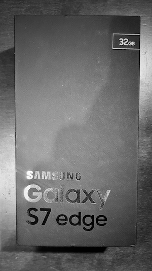

Samsung Galaxy S7 Edge
======================

##### Model
> Samsung Galaxy S7 Edge

##### Specs

* Processor: Samsung Exynos 8890 Octa
* GPU: Mali-T880 MP12
* Screen: 5.5-inch AMOLED, 1440x2560
* Camera: 12MP (f/1.7, OIS, back), 5MP (f/1.7, front)
* OS: Android 8.0

###### Experience

I am very please with this smartphone. The battery life is **very** good (3600MAh).
In comparison with my previous phone (iPhone 6), it is snappier, has a considerably better screen, expandable storage, better camera, NFC, wireless charging, etc.

The drawbacks of the device come mainly with it being an Android device (update rollout and lower quality apps of Play Store). However, some apps are only in Android (see JuiceSSH).

Another point worth mentioning is that this device is fragile. Having glass front and back, it is likely to break on the first drop, rendering it no water-resistant. But it is such a pretty gadget to have in a case ...

Last, I liked the fact that Samsung included a micro-USB to USB adapter in the package 👍. But the headphones left a lot to be desired ... 👎
