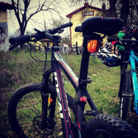

Ideal Pro Rider
===============

##### Model
> Ideal Pro Rider 2011 (mech-disk brakes)

##### Specs

* Frame	AL7005-T4/T6 MTB-hardtail
* Fork	RST Gila-Pro-ML, alloy crown & lowers, 30mm steel black uppers, preload & mechanical-lockout, 100mm travel
* Crankset	Shimano M171 42/34/24T*170mm black w/CG
* Rear Derailleur	Shimano new-Alivio M430
* Front Derailleur	Shimano M190
* Cassete/Freewheel	Shimano HG30 8sp cassette 11-13-15-18-21-24-28-32T
* Chain	KMC Z8
* Gear Cables	Shimano gear outer cables
* Handlebar	Kalloy riser bar, 64cm wide, 5o bend, 15mm rise, 31.8mm barbore
* Stem	Kalloy alloy, ahead, 90/105mm extension, 7o rise, 31.8mm barbore
* Shifters	Shimano ST-EF51 3*8sp easy-fire thumb-shifters
* Hubs	Shimano RM65 QR Center-Lock-disc
* Rims	X6 alloy, double wall, painted, disc
* Spokes	black 14G w/brass nipples
* Brake Set	Shimano M416 mechanical disc brakes, center-lock 180/160mm rotors
* Brake Levers	Shimano ST-EF51 alloy

##### Experience

Have it 3 years now and is a great value-for-money solution.
You can take it for a ride in the city or on the mountain. It won't fall short of your expectations, unless you are searching for performance.

Upgrades: Tires and Hydraulic brakes for better mountain performance. Fork would be my next change.