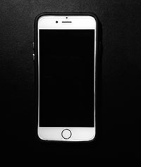

Apple iPhone 6
==============

##### Model
> Apple iPhone 6 64GB White

##### Specs

* Processor: Apple A8
* GPU: PowerVR GX6450
* Screen: 4.7-inch IPS, 750*1334
* Camera: 8MP(back), 1.2MP(front)
* OS: iOS 8.x

###### Experience

So far so good. The device's performance is second to none. Nothing like Android 4.4
on my previous Note II. The camera is really really great as well. OS updates are delivered
almost once a month.

However, under no circumstances could I state that it's a value-for-money solution.
Except for the price, I would also add to the caveats the openness of the OS as well as the
battery life of the phone, which is around 1,5 day; meh ...
