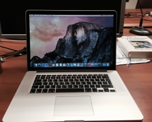

Macbook Pro
===========

##### Model
> Macbook Pro Retina 15", mid-2015

##### Specs

* CPU: 2.2 GHz i7-4770HQ quad-core Intel Core i7 Haswell with 6 MB on-chip L3 and 128 MB L4 cache
* RAM: 16GB, 1600MHz
* Disk: 256GB PCI-based SSD
* Screen: 15.4", 2,880 × 1,800 (16:10), 220 ppi

##### OS Setup

* <strike>OS X 10.11.4 (El Capitan)</strike> Ubuntu 18.04 LTS

##### Experience

This is the best laptop for the job so far. The screen is gorgeous, the performance top-notch and
the battery life more than satisfactory. The sound from the speakers is an upgrade as well. You can
do work from anywhere without carrying your desktop.

However, few things that I miss:
* An additional USB port would be nice
* Some extra space on the SSD (256GB is borderline ok for now)

**Update**: The screen has started to present artefacts under OS X. I have opened a [thread](https://discussions.apple.com/message/33728211) following up on the issue. Since the problem is not present under other OSs, I am using it with Ubuntu for now.
