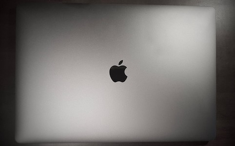

Macbook Pro
===========

##### Model
> Macbook Pro Retina 15", mid-2017

##### Specs

* CPU: 2.8 GHz i7-7700HQ quad-core Intel Core i7 Kaby Lake with 6 MB on-chip L3 cache
* RAM: 16GB, 1600MHz
* GPU: Intel HD Graphics 630, AMD Radeon Pro 555 (2GB DDDR5)
* Disk: 256GB PCI-based SSD
* Screen: 15.4", 2,880 × 1,800 (16:10), 227 ppi, Wide colour (P3) gamut, 500-nits

##### OS Setup

* OS X 10.13.6 (High Sierra)
* VMware running:
  * Linux Mint
  * CoreOS for containers
  * Vagrant for all sort of things

##### Experience

Upgraded from mid-2015 Macbook to this generation due to screen artefacts on the previous laptop.

My experience so far:

* The **good** parts:
  - The screen is gorgeous. Retina got a substantial upgrade with very nice blacks and higher levels of brightness.
  - Performance is awesome. Silent under everyday tasks, without uncomfortably warm. The disk is very fast.
  - I enjoyed the addition of the fingerprint sensor, especially after configuring sudo to authenticate with it in the "/etc/pam.d/sudo".
  - The speakers have become even better than the previous generation.
* The **bad** parts:
  - The keyboard leaves a lot to be desired. Definitely need to by an accompanying can of compressed air to keep everything functional.
  - I could do without the touchbar. Sometimes it gets stuck to blank and have to restart.
  - Space gray start to fade on palmrest; have to address this with Apple.
  - The dongle life is ... the new reality.

Overall, I would say "meh", considering its price.
