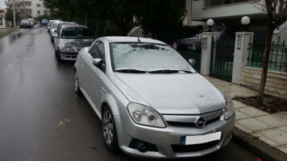

Opel Tigra
===========

##### Model
> Opel Tigra Twintop 2006, 1.4L

##### Specs

* 2-door roadster
* Engine: 1.4L 90PS (Z14XEP)
* Transmission: 5-speed manual
* Weight: 1,235 kg

##### Experience

It's driving experience is good enough, but not awe-inspiring.  
Fuel consumption is relatively good.  
Sublime driving position, being in the middle of the car. Sporty looks but not so sporty performance.

Absolutely satisfied for a student's first car.
